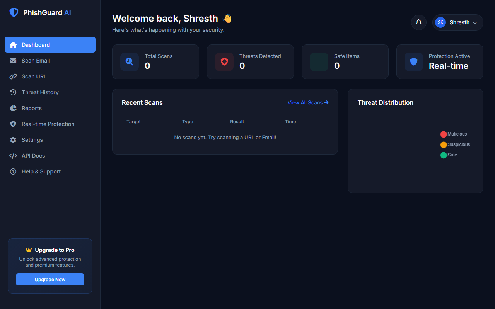
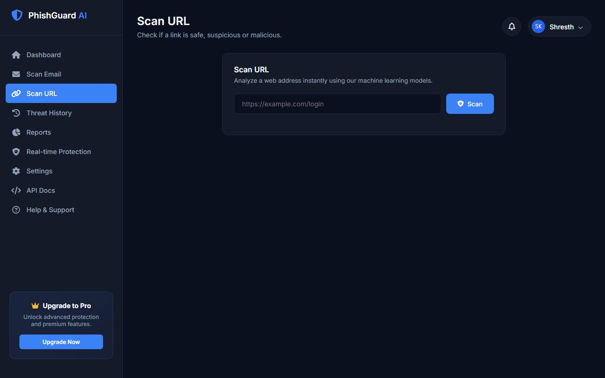
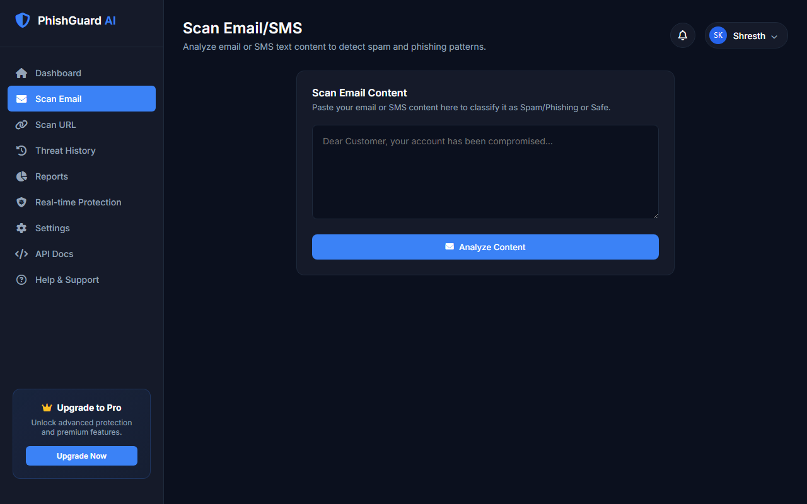

<div align="center">
  
  <h1>PhishGuard AI</h1>
  <p><strong>Intelligent AI-Enabled Phishing Detection and Alert System</strong></p>
  
  [](https://opensource.org/licenses/MIT)
  [](https://www.python.org/)
  [](https://flask.palletsprojects.com/)
  [](https://github.com/shresth16k/PhishGuard-AI/actions/workflows/trivy.yaml)
</div>

---

## 📖 Introduction

Phishing attacks remain one of the most prominent cybersecurity threats, compromising the personal information and financial assets of millions of individuals annually. According to reports, hundreds of millions of individuals are vulnerable to phishing, with hundreds of thousands falling prey to scammers.

**PhishGuard AI** is a comprehensive, intelligent Phishing Link and Email Analysis & Alert System. By integrating modern web frameworks with machine learning models, PhishGuard AI analyzes digital items (URLs and Emails) in real-time, helping individuals and organizations defend themselves against malicious cyber attacks.

### Developed by
- **Shresth Kesarwani**

---

## 🚀 Key Features

- **Double-Engine Phishing Detection**:
  - **URL Scanner**: Extracts **15 distinct features** across address bar structures, domain reputation, and HTML/JS properties to classify links via a trained Support Vector Machine (SVM) model.
  - **Email Classifier**: Employs Natural Language Processing (NLP) tokenization, punctuation removal, stopword filtering, and Porter stemming to classify email bodies using a pre-trained TF-IDF vectorizer and machine learning model.
- **Dynamic Security Dashboard**: Displays live metrics (total scans, threats detected, safe items, and individual classification logs).
- **Scan History & Auditing**: Local SQLite database to record all scans, categorizing results as **Safe**, **Suspicious**, or **Malicious** along with numerical threat scores.
- **Whitelist Fallback Verification**: Automatically cross-references scanned domains with a dataset of popular websites (`Web_Scrapped_websites.csv`) to minimize false positives for well-known legitimate services.

---

## 📸 UI Proof & Screenshots

<div align="center">
  <figure>
    
    <figcaption><em>PhishGuard AI Dashboard showcasing live threat metrics and recent scan logs</em></figcaption>
  </figure>
  <br>
  <figure>
    
    <figcaption><em>URL Phishing analysis interface with real-time feedback</em></figcaption>
  </figure>
  <br>
  <figure>
    
    <figcaption><em>Email body scanner with NLP-based phishing/spam classification</em></figcaption>
  </figure>
</div>

---

## 🛠️ Directory Structure

```text
PhishSleuth/
├── .github/
│   └── workflows/
│       └── trivy.yaml            # Trivy security vulnerability scanner workflow
├── assets/                       # UI screenshots and image assets for documentation
│   ├── dashboard.png
│   ├── logo.png
│   ├── scan_email.png
│   └── scan_url.png
├── icons/
│   └── logo.png                  # Main repository branding logo
├── phish-api/                    # Core Flask Backend & Machine Learning Application
│   ├── static/
│   │   └── icons/
│   │       └── logo.png          # Static web assets
│   ├── templates/                # Jinja2 HTML layout and page templates
│   │   ├── layout.html           # Main base template (sidebar, styles, routing structure)
│   │   ├── dashboard.html        # Interactive main statistics dashboard
│   │   ├── scan_email.html       # Email content input & submission form
│   │   ├── scan_url.html         # URL scanning page
│   │   ├── threat_history.html   # Full database scan records table
│   │   └── placeholder.html      # Flexible page template for secondary features
│   ├── app.py                    # Main Flask application (routes, DB connection, feature extraction, predictions)
│   ├── app.yaml                  # Google App Engine deployment configuration
│   ├── Procfile                  # Process file for Heroku/hosting deployments
│   ├── requirements.txt          # Python packages and dependency requirements
│   ├── SVM_Model.pkl             # Trained Support Vector Machine model for URL classification
│   ├── email_model.pkl           # Trained classifier model for email text classification
│   ├── vectorizer.pkl            # TF-IDF Vectorizer for preprocessing email content
│   ├── Web_Scrapped_websites.csv # Fallback validation dataset containing top-ranked safe domains
│   └── README.md                 # API subdirectory overview
├── LICENSE                       # MIT License file
└── README.md                     # Main project documentation (this file)
```

---

## 🧪 Model Performance & Algorithms

To select the most robust models, a wide variety of machine learning algorithms were benchmarked for phishing detection capability:

| Algorithm | Accuracy | Precision | Accuracy (Max Features = 3000) |
| :--- | :---: | :---: | :---: |
| **Extra Trees Classifier (ETC)** | **0.9796** | 0.9914 | **0.9796** |
| **Naive Bayes (NB)** | 0.9787 | **1.0000** | 0.9719 |
| **Random Forest (RF)** | 0.9758 | 0.9908 | 0.9758 |
| **Support Vector Classifier (SVC)** | 0.9719 | 0.9741 | 0.9748 |
| **XGBoost (xgb)** | 0.9680 | 0.9504 | 0.9680 |
| **Logistic Regression (LR)** | 0.9671 | 0.9400 | 0.9564 |
| **AdaBoost** | 0.9613 | 0.9541 | 0.9613 |
| **Bagging Classifier (BgC)** | 0.9593 | 0.8615 | 0.9593 |
| **Gradient Boosting (GBDT)** | 0.9468 | 0.9313 | 0.9593 |
| **Decision Tree (DT)** | 0.9323 | 0.8380 | 0.9313 |
| **K-Nearest Neighbors (KNN)** | 0.9052 | 1.0000 | 0.9052 |

*Note: The primary engine utilizes a trained SVM Model for URL classification and a specialized Naive Bayes/TF-IDF text classification stack for emails.*

---

## 🔍 Extracted URL Features (15 Attributes)

When a URL is scanned, the feature extraction engine processes it and builds a vector based on:
1. **IP Address Presence**: Checks if the domain name is represented as an IP address.
2. **@ Symbol Check**: Inspects the URL for `@` or other special redirection characters.
3. **URL Length**: Categorizes whether the length exceeds standard guidelines.
4. **URL Depth**: Measures folder depths along the path.
5. **Redirection (//)**: Examines the position of protocol/redirection slash elements.
6. **HTTPS Token in Domain**: Detects if `https` is spoofed inside the domain part (e.g. `http://https-bank.com`).
7. **Shortening Service**: Flags URLs using services like bit.ly or tinyurl.
8. **Hyphen Separators (-)**: Detects dashes in the domain name (highly correlated with phishing).
9. **DNS Records**: Verifies active DNS lookup capability.
10. **Web Traffic**: Integrates lookup indicators.
11. **Domain Age**: Measures if the registration age is less than 6 months.
12. **Domain Expiration**: Evaluates how close the domain is to its termination date.
13. **IFrame Presence**: Checks if the target page rendering contains frame redirects.
14. **Mouse Over Events**: Inspects scripts modifying the status bar content.
15. **Web Forwardings**: Counts the number of HTTP redirection steps.

---

## ⚙️ Installation & Usage

Follow these steps to run PhishGuard AI locally:

### Prerequisites
- Python 3.8+ install
- Git

### Steps
1. **Clone the repository**:
   ```bash
   git clone https://github.com/shresth16k/PhishGuard-AI.git
   cd PhishGuard-AI
   ```

2. **Navigate to the API folder**:
   ```bash
   cd phish-api
   ```

3. **Install dependencies**:
   ```bash
   pip install -r requirements.txt
   ```
   *(This will install Flask, scikit-learn, numpy, nltk, beautifulsoup4, tldextract, python-whois, and other required packages)*

4. **Launch the application**:
   ```bash
   python app.py
   ```

5. **Access the Web Dashboard**:
   Open your preferred browser and visit:
   ```text
   http://127.0.0.1:5000/
   ```

---

## 📜 License

This project is licensed under the [MIT License](LICENSE) - see the LICENSE file for details.
